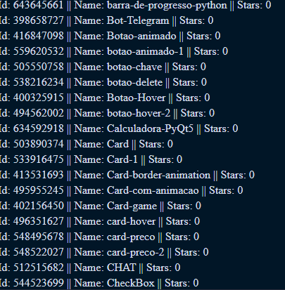

# Request api github

Listando o id do projeto o nome do projeto e o numero de estrelas

## Instalar

<ul>
  <li>Primeiro crie uma pasta e abra a pasta pelo vscode</li>
  <li>Segundo digite o comando python -m venv venv no terminal do vscode</li>
  <li>Terceiro digite o comando pip install -r requirements.txt no terminal do vscode</li>
  <li>Por último digite python main.py no terminal do vscode</li>
</ul>

## Tecnologias utilizadas

<ul>
  <li>Python</li>
</ul>

## Screenshot 

